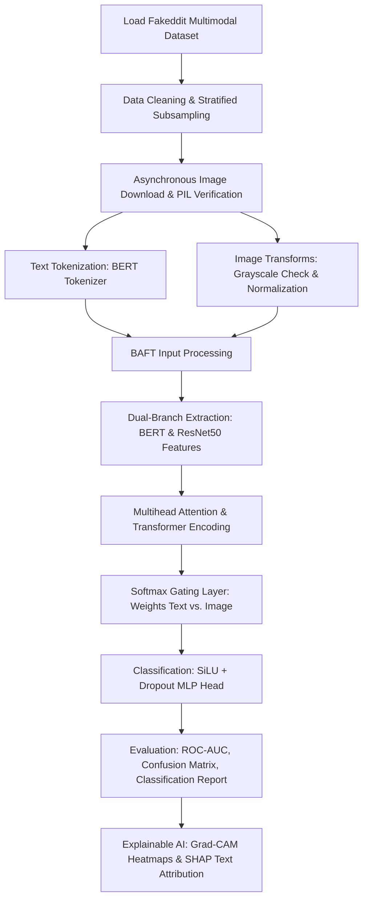

# Multi-Modal Fake News Detection

This project presents a robust, end-to-end deep learning pipeline for detecting fabricated and misleading news by checking for cross-modal inconsistencies across both textual headlines and their associated imagery. Utilizing the benchmark **Fakeddit** dataset, it integrates state-of-the-art Natural Language Processing (NLP) and Computer Vision (CV) architectures within a custom-gated neural fusion network:

* **Gated Bidirectional Attention Fusion Transformer (BAFT) Architecture** combining a pre-trained `bert-base-uncased` transformer for textual encoding and a pre-trained `ResNet50` for deep spatial image feature extraction.
* **Dynamic Cross-Modal Gating Mechanism** that maps text and image projections through an attention encoder, computing soft attention weights via a specialized linear gating layer to dynamically balance feature importance depending on context.
* **Rigid Preprocessing & Content Validation** including automated corrupt image detection using PIL verification, multi-channel structural analysis, text tokenization, and heavily augmented geometric transformations to prevent model overfitting.
* **Dual-Modality Explainable AI (XAI)** integrating **Grad-CAM** to map pixel activation intensities on image layers alongside **SHAP** text maskers to observe word-level attribution values.

---

## Pipeline Overview



---

## Notebook Structure & Code Architecture

The entire pipeline is self-contained within the PyTorch-backed notebook, driving operations sequentially from hardware validation to multi-modal explanation.

### 1. Ingestion & Stratified Sampling

* **Dataset Partitioning:** Loads the multimodal subsets of Fakeddit. To optimize computation, it isolates an experimental subset (7% of total volume) while strictly preserving binary label distributions via stratified splitting boundaries before structuring the standard 70/30 Train/Test splits.
* **Feature Pruning:** Drops non-textual metadata attributes (`subreddit`, `domain`, `upvote_ratio`, etc.) to isolate raw text inputs (`clean_title`) and target outputs (`2_way_label`).

### 2. Robust Multi-Modal Preprocessing Engine

* **Asynchronous Data Fetching:** Spawns a resilient download stream using `urllib.request` to map URLs to local destinations, logging and dropping instances with dead links or network timeouts.
* **PIL Corrupt Image Filtering:** Runs an explicit verification sweep (`img.verify()`) to spot truncated or corrupt files, completely purging them to secure downstream batch operations.
* **Advanced Transforms:** Applies geometric and color augmentations via `torchvision.transforms` for the training loop (including `RandomCrop`, `ColorJitter`, and `RandomRotation`), while stabilizing testing data through fixed resolution rescaling ($224 \times 224$) and ImageNet standard normalization arrays.

### 3. The BAFT Architecture & Cross-Modal Gating

The **BAFTModel** is engineered as a highly adaptive multi-modal system:

* **Text Branch:** Feeds tokenized inputs into a pre-trained HuggingFace `BertModel`. Instead of using a standard CLS token token classification head, it computes a more expressive mean pooling representation across the sequence length, filtering padded elements via an attention mask before scaling through a 512-dimensional projection layer.
* **Image Branch:** Extracts global spatial representations using a pre-trained `resnet50` architecture, stripping the trailing fully connected layer to feed the $2048$-dimensional feature pool into an identical 512-dimensional linear projection array.
* **Attention Fusion:** Stacks the dual 512-dimensional vectors into an unified matrix sequence, passing it through an 8-head `nn.MultiheadAttention` block and a 3-layer `nn.TransformerEncoder` powered by GELU activations.
* **Softmax Gated Routing:** Concatenates raw textual and visual projections, evaluating their combined context via a linear layer to yield a 2-dimensional softmax tensor. These weights dynamically scale the text and image sequence embeddings to form a optimized, fused classification context vector.

### 4. Custom Training Suite

* **Regularized Loss Configuration:** Employs Cross-Entropy Loss augmented with a `label_smoothing=0.1` threshold to protect the network from overconfident predictions and data noise.
* **Optimization Strategy:** Deploys the `AdamW` optimizer matched with a `CosineAnnealingLR` scheduler over 10 epochs, systematically stepping down learning thresholds along a cosine curve to locate global minima.

---

## Results and Visualization

The evaluation suite outputs inline diagnostic reports and interactive graphics directly within the notebook interface:

* **Classification Diagnostics:** Yields precise performance metrics across Precision, Recall, and F1 scores, alongside an annotated Seaborn heatmap visualization of the Confusion Matrix to check error rates between classes.
* **ROC Dynamics:** Plots full True Positive vs. False Positive rate trajectories, explicitly tracking the Area Under the Curve (AUC) value to map discriminative power.

### Breaking the Black Box (Dual-Modality XAI)

```text
                             [BAFT Model Classification Output]
                                      /              \
                                     /                \
                [Image Input Branch]                    [Text Input Branch]
                         |                                       |
                (Grad-CAM Heatmaps)                     (SHAP Text Plots)
          Targets last ResNet block layer         Token-level impact scoring

```

* **Visual Interpretability (Grad-CAM):** Uses `pytorch-grad-cam` to isolate the final convolutional block of the image branch (`model.resnet[-2][-1]`). It overlays a jet-color heatmap over input images to show the exact spatial features driving the classification decision.
* **Textual Interpretability (SHAP):** Builds a custom `TextModelWrapper` that freezes the image token states while passing iterative text variations through a SHAP `Explainer`. This generates detailed token attribution charts that highlight individual words according to how heavily they pushed the final probability score toward a fake or real prediction.
